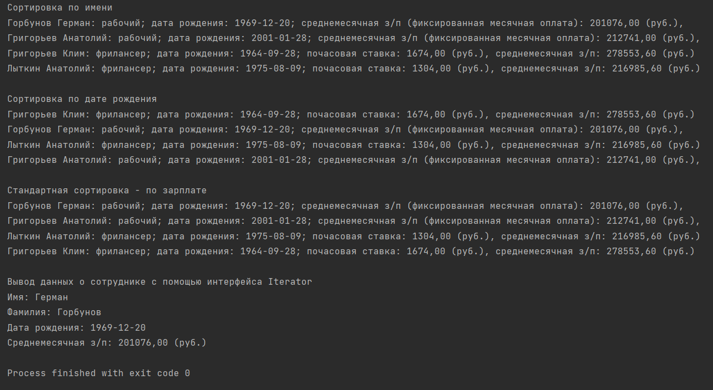

1. Реализован класс freelancer

2. Добавлен метод, рассчитывающий среднемесячную з/п для фрилансеров

3. При выводе информации о работнике печатается результат метода конкретного класса calculateSalary()

4. Для базового класса добавлено поле birthday (включено в конструкторы класса Employee). Создан класс, генерирующий случайную дату рождения RandomDate

5. Создана коллекция на базе абстрактного класса Employee, заполнен рабочими и фрилансерами

6. Реализован класс EmployeeBirthdayComparator, позволяющий сортировать работников по дате рождения

7. В классе Employee реализован интерфейс Iterator для последовательного вывода информации о сотруднике

